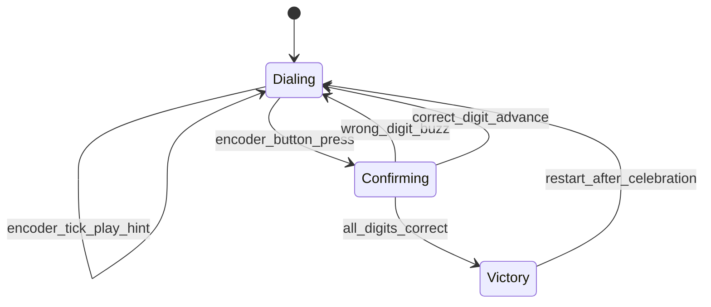

# Safe Cracker — Implementation and Test Plan

## Goal

Build a combination-lock game: spin the [KY-040 rotary encoder](https://www.amazon.com/dp/B07B68H6R8) to dial digits 0–9, press the built-in encoder button to lock in each digit, and get **audio hints** (pitch/volume changes) as you get closer to the correct value. Match the full secret sequence to “open the safe.”

This pass focuses on **working code + hardware validation** (per your preference). LaTeX guide, BOM, and photos come later, modeled on [YWIT-2025](https://github.com/NetApp-PTC/YWIT-2025).

---

## Game Design



| Mechanic | Choice | Rationale |
|---|---|---|
| Code length | 3 digits (config constant) | Short enough for a workshop demo; easy to extend |
| Digit range | 0–9, bounded encoder | One detent per number; familiar “combination lock” feel |
| Secret code | Random at boot (`random.randint`) | Replayable; print to serial for instructor debugging |
| Proximity | Circular distance on dial (wraps 9→0) | “Nearing” works both directions |
| Enter digit | Encoder SW button (debounced) | Matches idea doc; no extra parts |
| Wrong digit | Low buzz + stay on same dial position | Clear feedback without ending game |
| Win | Ascending victory arpeggio | Distinct from hint tones |

**Audio hint mapping** (on each encoder tick while dialing):

| Distance to target | Feedback |
|---|---|
| 0 (exact) | Short high “click” (~880 Hz, 80 ms) |
| 1–2 away | Mid “warm” tone (~440–660 Hz, 50 ms) |
| 3+ away | Low quiet tone (~220 Hz, 30 ms) or silence |

Reuse the PWM tone pattern from [YWIT-2025 Project 5](https://github.com/NetApp-PTC/YWIT-2025/blob/main/micropython_workshop/project_code/project_5_worlds_worst_piano.py):

```python
pwm = PWM(speaker_pin, freq=freq, duty=512)
time.sleep_ms(duration_ms)
pwm.deinit()
```

---

## Hardware Wiring (your bench setup)

**Board:** Seeed XIAO ESP32-C3 @ `/dev/cu.usbmodem2101`  
**Encoder:** KY-040 (5-pin module with onboard 10kΩ pull-ups)  
**Speaker:** [Treedix 1W 8Ω mini speaker](https://www.amazon.com/Treedix-Full-Range-Advertising-JST-PH2-5mm-2-Electronic/dp/B0D878Q3JH) (JST 2-pin: signal + GND)

Pin assignments mirror 2025 Project 5 for consistency when the full kit guide is written later:

| Component | Signal | XIAO GPIO | XIAO label |
|---|---|---|---|
| KY-040 | CLK | 10 | D10 |
| KY-040 | DT | 9 | D9 |
| KY-040 | SW | 8 | D8 |
| KY-040 | VCC | 3V3 | 3V3 |
| KY-040 | GND | GND | GND |
| Speaker | + (JST) | 20 | D7 |
| Speaker | − (JST) | GND | GND |

**Important notes:**
- Power the KY-040 from **3.3V**, not 5V — keeps logic levels ESP32-safe ([Seeed wiki](https://wiki.seeedstudio.com/XIAO_ESP32C3_Getting_Started/)).
- GPIO 8/9 are strapping pins; the 2025 workshop uses them successfully when wired on a breadboard after boot. If you hit upload/boot issues, fall back to safer pins (e.g. CLK=3, DT=4, SW=5) and update constants.
- Drive the 8Ω speaker via PWM at moderate duty (~512/1023); keep tones short to avoid overheating the GPIO driver.

---

## Repo Layout (this pass)

Create under [`micropython_workshop/`](micropython_workshop/):

```
micropython_workshop/
├── project_code/
│   ├── lib/
│   │   ├── debounced_button.py   # copy from YWIT-2025
│   │   ├── rotary.py             # copy from YWIT-2025
│   │   └── rotary_irq.py         # copy from YWIT-2025
│   ├── test_speaker.py           # smoke test: beep sweep
│   ├── test_encoder.py           # smoke test: print dial value
│   └── project_1_safe_cracker.py # full game
└── microcontroller_workshop_ideas.md  # (existing)
```

Copy the three `lib/` files verbatim from [YWIT-2025 `project_code/lib/`](https://github.com/NetApp-PTC/YWIT-2025/tree/main/micropython_workshop/project_code/lib) — they are proven on this exact board.

**`project_1_safe_cracker.py` structure:**

1. **Config block** — `CODE_LENGTH`, GPIO pins, tone frequencies
2. **`play_tone(freq, ms)`** — PWM helper
3. **`dial_distance(current, target)`** — circular 0–9 distance
4. **`play_hint(distance)`** — map distance → tone
5. **`setup_components()`** — `RotaryIRQ(0..9, bounded)`, `DebouncedButton(SW, on_enter)`
6. **Game state** — `secret_code`, `dial_index`, encoder listener updates hints
7. **Serial UI** — print current dial, progress (`Dial 2/3: showing 7`), and secret on boot (dev mode)

No OLED required for v1 — serial REPL is enough for development; optional OLED can be added in a later project chapter.

---

## Implementation Steps

### Step 1 — Copy shared libraries

Copy `debounced_button.py`, `rotary.py`, `rotary_irq.py` from YWIT-2025 into [`micropython_workshop/project_code/lib/`](micropython_workshop/project_code/lib/).

### Step 2 — `test_speaker.py`

Minimal script: play 440 Hz for 500 ms, then a short ascending sweep. Confirms JST polarity and PWM before other wiring complexity.

### Step 3 — `test_encoder.py`

Wire encoder, use `RotaryIRQ` with `pull_up=True`, `range_mode=RANGE_BOUNDED`, `min_val=0`, `max_val=9`. Print value on change; print “BUTTON” on SW press via `DebouncedButton`. Verify CW/CCW direction; flip `reverse=True/False` if digits go backwards.

### Step 4 — `project_1_safe_cracker.py`

Implement full game loop:
- Generate `secret_code` list at startup
- On encoder listener: read value → compute distance to `secret_code[dial_index]` → `play_hint()`
- On button press: compare dial to target; advance `dial_index` or buzz; on completion play victory sequence and reset

### Step 5 — Upload and run on device

Using `mpremote` (install via `pip install mpremote` if needed):

```bash
PORT=/dev/cu.usbmodem2101

# Verify connection
mpremote connect $PORT repl

# Upload libs + tests + game (from repo root)
mpremote connect $PORT fs cp micropython_workshop/project_code/lib/debounced_button.py :lib/debounced_button.py
mpremote connect $PORT fs cp micropython_workshop/project_code/lib/rotary.py :lib/rotary.py
mpremote connect $PORT fs cp micropython_workshop/project_code/lib/rotary_irq.py :lib/rotary_irq.py
mpremote connect $PORT fs cp micropython_workshop/project_code/test_speaker.py :test_speaker.py
mpremote connect $PORT fs cp micropython_workshop/project_code/test_encoder.py :test_encoder.py
mpremote connect $PORT fs cp micropython_workshop/project_code/project_1_safe_cracker.py :project_1_safe_cracker.py

# Run tests in order
mpremote connect $PORT run micropython_workshop/project_code/test_speaker.py
mpremote connect $PORT run micropython_workshop/project_code/test_encoder.py
mpremote connect $PORT run micropython_workshop/project_code/project_1_safe_cracker.py
```

Alternative: use [Viper IDE](https://viper-ide.blackhart.dev/) (2025 workshop tool) — drag files to device filesystem and hit Run.

---

## Test Plan (incremental)

| Phase | What to verify | Pass criteria |
|---|---|---|
| **T0 — Connection** | `mpremote connect $PORT repl` | REPL prompt; `import machine; machine.unique_id()` works |
| **T1 — Speaker only** | Run `test_speaker.py` with speaker on GPIO 20 | Audible beep/sweep; no distortion at short duty |
| **T2 — Encoder only** | Run `test_encoder.py` | Serial prints 0–9 as knob turns; button events fire once per press |
| **T3 — Hint tones** | Run game, read secret from serial, spin to target digit | Tone gets higher as distance shrinks; distinct click at exact match |
| **T4 — Full crack** | Enter all 3 digits correctly | Victory arpeggio; game resets with new code |
| **T5 — Wrong entry** | Deliberately enter wrong digit | Buzz sound; stays on same dial index |
| **T6 — Edge cases** | Wraparound (target 0, dial from 9) | Distance computed as 1, not 9; hint still “warm” |

**Debugging cheatsheet:**
- No sound → swap JST wires; confirm GPIO 20 and GND
- Encoder counts erratically → add `pull_up=True` to `RotaryIRQ`; check 3.3V power
- Button double-fires → `DebouncedButton` already debounces 300 ms; check wiring to SW not CLK
- Wrong direction → toggle `reverse=` in `RotaryIRQ`

---

## Later (out of scope for this pass)

When code is stable on hardware, extend to full YWIT-2025 parity:
- [`project_guide/projects/project_N.tex`](micropython_workshop/project_guide/) chapter with breadboard coordinates
- Wiring photos in `project_guide/images/project_N/`
- BOM entry for KY-040 + Treedix speaker
- Refresh `microcontroller_image.bin` via `esptool read_flash` ([2025 README pattern](https://github.com/NetApp-PTC/YWIT-2025))
- Root `README.md` workshop section

---

## Key References

- Idea spec: [`micropython_workshop/microcontroller_workshop_ideas.md`](micropython_workshop/microcontroller_workshop_ideas.md) (lines 26–29)
- 2025 encoder + speaker pattern: [`project_5_worlds_worst_piano.py`](https://github.com/NetApp-PTC/YWIT-2025/blob/main/micropython_workshop/project_code/project_5_worlds_worst_piano.py)
- Rotary library: [MikeTeachman/micropython-rotary](https://github.com/MikeTeachman/micropython-rotary)
